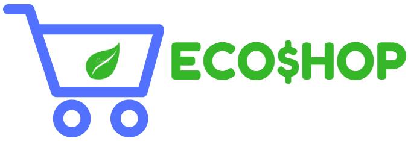

## ECO$HOP

EcoShop es un Ecommerce de productos ecológicos, se puede encontrar el nombre, precio, imagen, calificación, la descripción del articulo y de que parte de la República Mexicana lo venden.

OBJETIVO

Promover las sustenabildad mediante la  venta de productos ecológicos/sustentables y tecnologias 

- Visualizar productos amigables con el medio ambiente.
- Seleccionar productos y agregarlos/quitarlos a lista de compra.
- Realizar pago con PayPal.

CONTENIDO-FUNCIONALIDADES.

1. El contenido de el sitio consiste en obtener  de la API de Mercado Libre las imagenes de cada producto. Cada uno de ellos ofrece la descripción  del articulo el precio y calificacion dada de otros usuarios que se muestra atravez de un modal.
2. El usuario tiene la manera  de poder agrgar y quitar productos del carrito.
3. Puede hacer busca de productos en especifico se filtran los productos.

DESARROLLO.

API MERCADO LIBRE, Para usar su base de datos y sacar la información de los productos ecológicos/sustentables, las imágenes y precios.

API PayPal, para poder utilizarla como método de pago de la compra de los productos.

FLUJO DEL PROGRAMA.

Integrar la API MERCADO LIBRE, una vez generada la API Key, se extrae la data que se va a utilizar y se manipula dinámicamente a través del DOM.

Integrar la API DE PayPal, una vez generada la cuenta en su pagina, el token y una app que genera un ID para poder usar en el código que da la API y poderlo integrar al nuestro y también integrar el botón de PayPal.

